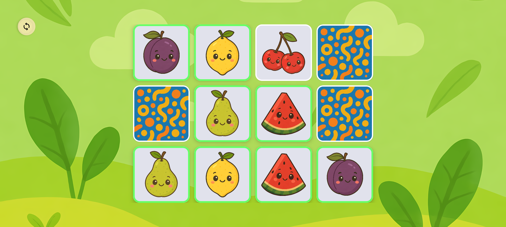
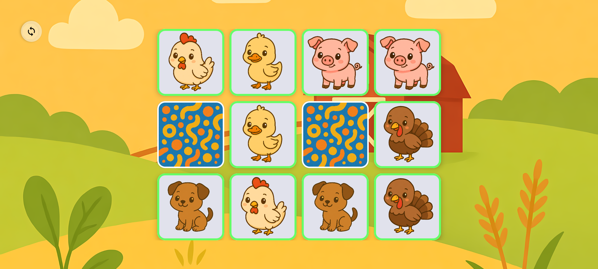

## 👶 Made for tiny explorers (ages 2-6)

Turn screen time into brain-boosting fun with Memory Match for kids—a vibrant and ad-free card-matching game!.

Why kids (and parents!) love it:
- Bright, lovable themes – sea animals, dinosaurs, fruit and more to come!
- Grows with your child – multiple board sizes (2×2, 3×2, 4×3, 4×4, 6×4, 6×5) that gently ramp up the challenge.
- Positive rewards – get a burst of confetti that celebrate every success.
- No reading required – big icons, cheerful voice-overs, and simple tap controls.
- Safe & private – 100% ad-free, purchase-free, and tracker-free. We collect zero data, so your family’s privacy stays completely intact while your little angels play.

Built-in learning benefits:

🧠 Improves memory & concentration
🎨 Boosts visual recognition & pattern skills

[Download Memory Match for kids](https://github.com/RikudouSage/KidMemoryGame/releases/latest) today and watch your little one light up as they learn! 🚀

## Screenshots






## Technical details

The game is built using Kotlin, to compile it yourself, simply clone the repository, open it in Android
Studio and build away.

There are two flavours: `full` and `lite`. The `full` flavour contains all images as part of the
application, that allows it to be fully offline at the cost of larger file sizes for updates. The
`lite` version does not contain any packs built-in and lets you download those that you want, meaning
it needs access to internet, but the update size is smaller.

## Plugins (Theme Packs)

The app supports third-party theme packs, allowing you to create and install your own custom themes. Once installed, the app will automatically discover them.

A detailed guide is on the way, but here’s a quick overview of how to integrate your theme pack:

### How it works
- Your app (the plugin) needs to respond to a broadcast intent with the action:  
  `cz.chrastecky.kidsmemorygame.REQUEST_THEME_INFO`
- In response, you should provide a **Content Provider** that can handle query requests and return two key properties:
    - `basePath`: A full URI (as a string) pointing to the **directory containing the root `themes.json`** file.
    - `packageId`: Your app’s Android package ID.

### Required Files
- **themes.json** (root file):
    - This file lists all available theme packs provided by your plugin.
    - Its format should match this app's [themes.json](themes/themes.json).
    - All properties are required, except for `hash`.

- **theme.json** (per theme pack):
    - Each theme pack should have its own `theme.json` file describing the theme's assets.
    - You can use the [sea pack theme.json](themes/sea/theme.json) as an example.
    - All properties are required, except for `mascots` and `hash`.

### Security Considerations

For better security, both the **broadcast receiver** and the **content provider** can require the following permission to interact with the memory game app:

```
cz.chrastecky.kidsmemorygame.PERMISSION_REQUEST_THEMES
```


This ensures that only trusted apps can respond to theme requests or provide theme data.