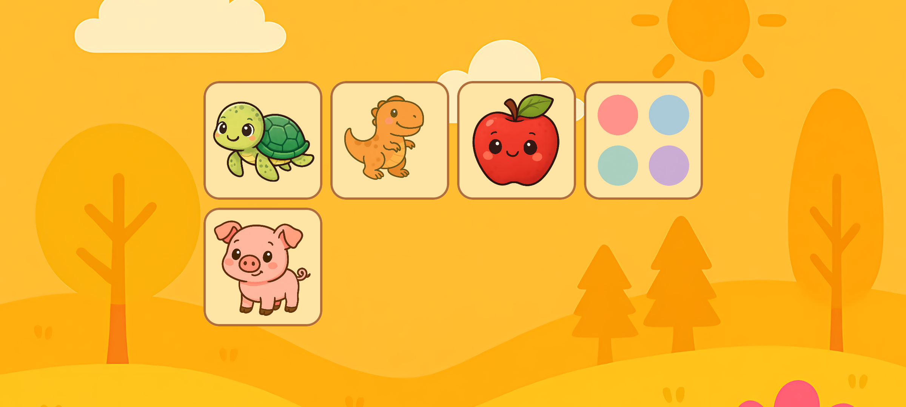
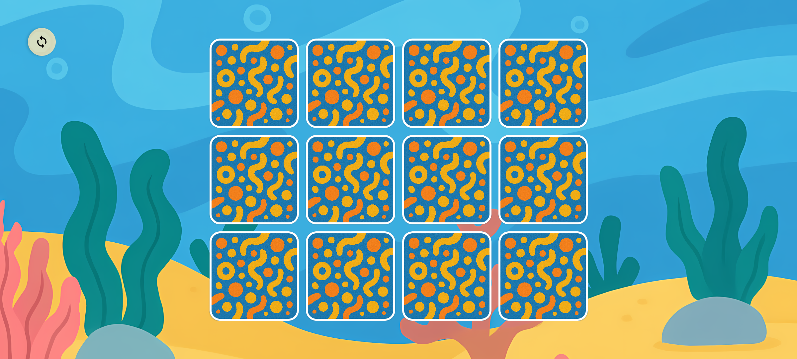
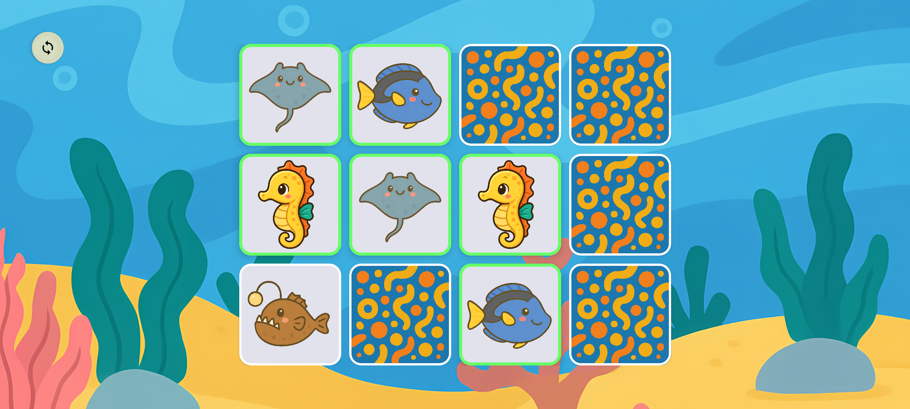
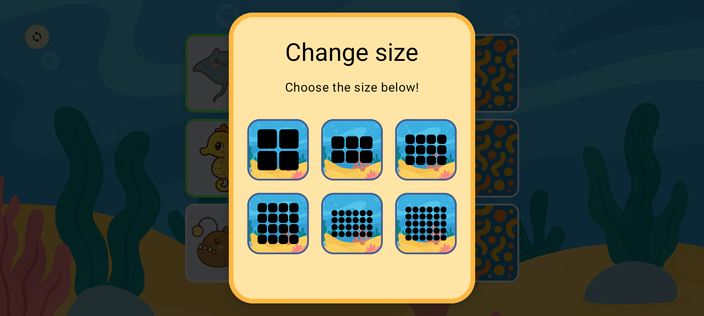

## 👶 Made for tiny explorers (ages 2-6)

Turn screen time into brain-boosting fun with Memory Match for kids—a vibrant and ad-free card-matching game!.

Why kids (and parents!) love it:
- Bright, lovable themes – sea animals, dinosaurs and more to come!
- Grows with your child – multiple board sizes (2×2, 3×2, 4×3, 4×4, 6×4, 6×5) that gently ramp up the challenge.
- Positive rewards – get a burst of confetti that celebrate every success.
- No reading required – big icons, cheerful voice-overs, and simple tap controls.
- Safe & private – 100% ad-free, purchase-free, and tracker-free. We collect zero data, so your family’s privacy stays completely intact while your little angels play.

Built-in learning benefits:

🧠 Improves memory & concentration
🎨 Boosts visual recognition & pattern skills

[Download Memory Match for kids](https://github.com/RikudouSage/KidMemoryGame/releases/latest) today and watch your little one light up as they learn! 🚀

## Screenshots

## Technical details

The game is built using Kotlin, to compile it yourself, simply clone the repository, open it in Android
Studio and build away.

There are two flavours: `full` and `lite`. The `full` flavour contains all images as part of the
application, that allows it to be fully offline at the cost of larger file sizes for updates. The
`lite` version does not contain any packs built-in and lets you download those that you want, meaning
it needs access to internet, but the update size is smaller.
